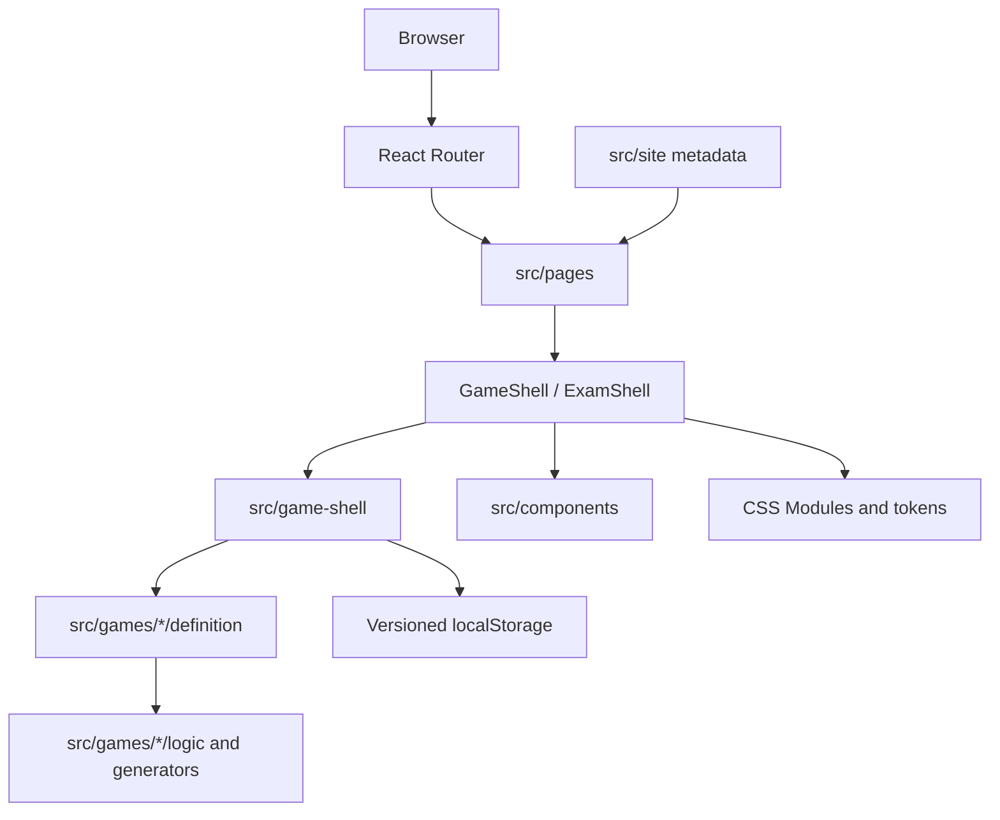
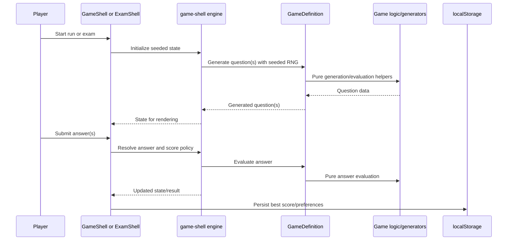
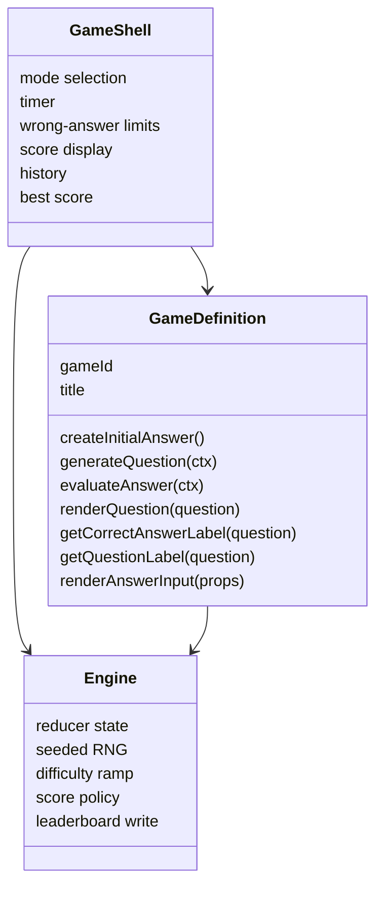

# Architecture

MathGames is a client-only React application for solo math competition games. The current architecture is Phase 1.5: static hosting, deterministic local gameplay, versioned browser storage, and no backend dependency.

## Tech Stack

- **Runtime/UI**: React 19 with TypeScript
- **Build tool**: Vite
- **Routing**: React Router
- **Styling**: CSS Modules plus shared CSS custom properties in `src/styles/tokens.css`
- **Icons**: `lucide-react`
- **Testing**: Vitest
- **Static generation**: `scripts/generate-site-assets.mjs` for `robots.txt` and `sitemap.xml`
- **Deployment target**: Cloudflare Pages static build

The app is intentionally browser-only in this phase. There are no backend APIs, authentication flows, global score submissions, or server-side validation paths.

## System Overview



Routes stay thin. They select a game definition and render the appropriate shared shell. Core lifecycle, scoring, seeded generation, difficulty, and storage behavior stay in `src/game-shell/`.

## Runtime Flow

MathGames has two gameplay shell families:

- `GameShell` for arcade-style `sprint` and `survival` runs.
- `ExamShell` for fixed-length `exam` flows, currently used by A+ Number Sense.



Rendering must not consume RNG. Given the same seed and inputs, generation must be replayable for future validation.

## Source Layout

```text
src/
  game-shell/   Shared run/exam engines, RNG, difficulty, scoring, storage
  games/        Per-game definitions, pure logic, custom inputs, tests
  components/   Shared UI shells, layout, theme, landing components
  pages/        Thin route wrappers
  site/         Site metadata and canonical URL helpers
  styles/       Shared CSS modules and design tokens
docs/
  gameplay/     Player-facing rules
  plans/        Roadmap, backlog, and implementation plans
scripts/        Static asset generation
```

Important ownership boundaries:

- Pages do not contain gameplay logic.
- Game UI does not manipulate leaderboards directly.
- Per-game folders provide definitions and pure logic, not one-off lifecycle systems.
- Shared shells own player interaction flow and display state, but not game-specific question rules.
- Storage migrations live in `src/game-shell/` and must preserve existing user data.

## Game Model

Arcade-style games implement a typed `GameDefinition` contract. A definition provides question generation, answer evaluation, labels, rendering hooks, and optional custom answer input UI.



Current shipped games:

- `speed-arithmetic`: sprint/survival arithmetic questions.
- `factor-rush`: sprint/survival prime factor selection with custom input.
- `power-blitz`: sprint/survival exponent questions.
- `target-24`: sprint/survival expression entry with custom input.
- `number-sense`: exam-mode A+ Number Sense assessment.

## State, Scoring, And Storage

Run state is reducer-driven where practical. Shared state includes phase, mode, score, total answered, streak, wrong answers, timer state, difficulty level, current question, feedback, history, and run seed.

Scoring is injectable:

- Sprint/survival default: one point per correct answer.
- Number Sense exam: `+5` correct, `-4` wrong, `0` blank.

Browser storage is versioned and documented in `docs/storage.md`. Current primary keys:

- `mathgames.leaderboard`: best scores by `${gameId}|${mode}`.
- `mathgames.sprintPrefs`: per-game sprint duration preference.
- `mathgames.ui.theme`: theme preference.

Sprint duration is not part of leaderboard identity. Exam bests reuse the stable `gameId|exam` pattern.

## Build And Verification

Common commands:

```bash
npm run dev
npm run build
npm run lint
npm test
```

`npm run build` runs TypeScript project builds and Vite production bundling. `npm test` runs Vitest coverage for engines, storage, scoring, definitions, and game logic.

## Future Phase Boundary

Phase 2 may add Cloudflare Workers, global leaderboard reads/writes, anonymous identity, heartbeat, and lightweight validation. Those features should integrate behind explicit client/service boundaries when they are introduced.

Until then, the production app must remain a static client build. Do not add backend calls, authentication, remote score submission, global stats, anti-cheat, or account persistence in Phase 1.5.
